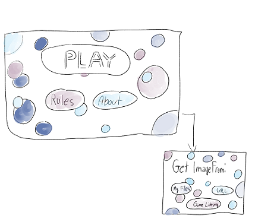
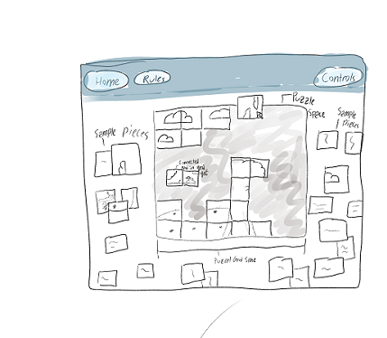

# I. High Concept

  Much like common jigsaw puzzles but with straight-edged square tiles rather than ones with jagged teeth or holes. Also, since this is digital, the player can upload their own photos into the game.

# II. Genre
	
  This game is one-hundred percent a puzzler.

# III. Platform 

  This game’s platform is on desktop only. 

# IV. Mood 

  This game’s mood is all about what the player makes of it using built in-game tools. The player can go for a tense, hard experience by dividing their photo into many squares and including the timer mechanic or could go for a relaxing, easy one by setting the divisions lower and not including a timer. The narrative is built by one’s personal progress with the pieces and the premise of the game is to take a fractured, twisted photo and return it to its original state. 

# V. Esthetics

  The Esthetics of this game will involve nice calming hues for the backgrounds and buttons that are abstract and simplistic enough so that they will provide an appropriate backdrop to whatever picture is uploaded.

# VI. Gameplay

## Mechanics
  The player can upload a photo from their own files, select one from a predefined static game library, or possibly paste one in using a URL. Once they start, the image will be divided into squares and the pieces’ randomly scrambled and rotated. The player can then try to match the pieces together in order to restore the original picture.

## Control
  The players will use the mouse to pick up, by left-clicking, a fragment and drag it over to a piece they believe it connects to. After dropping it, by left-clicking, the pieces will connect into one piece if they match or will both turn red for a second if they don’t. If the user thinks they need to rotate the piece by ninty degrees to make it fit, they can do so by right-clicking or by pressing the ‘r’ key.
  
## Teaching The Game
  Most players will be familiar with jigsaw puzzles, and other than learning the specific digital controls (which can be re/viewed by clicking a ‘controls’ button at any point while playing) will not need any extra explanation on how to complete the game. For players that do need those instructions, however, a button called ‘instructions’ will be on the menu page the player will see before starting the game. This button will pull up rules explaining how to play this game. This button mechanic will allow new players to learn at their own pace and let familiar players bypass the explanation altogether if they choose. 

## Player Learning
  There isn’t too much depth to this game. Much like other simple puzzles (such as jigsaw puzzles or sodoku), the same strategies can be used over and over again since the number of divisions and random rotation of pieces is the only thing that changes. Players may find personal strategies to help them complete the puzzles faster but other than that there’s not much else that can be used/learned. 
  
# VII. Pictures

A mockup of the menu for the game

A mockup of the website's game state

# VIII. About The Developer
Whitney Kluttz is a second year game design and development major at Rochester Institute of Technology. His interests includes working on team projects and designing game mechanics and narrative for games.
